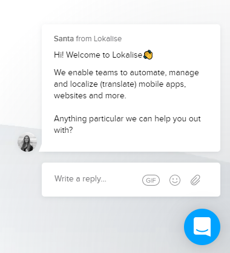

# fancy clippy site with animation and chat
Build a fancy website with clip-path, animations and a chat-window.

## challenge - part I - clippy site with animations

> https://thedrawingroomcreative.com/

Build a website from the template above, but use your own content (e.g. your own imaginary brand or page about yourself). Start with the desktop view.

The following elements are important:
- Positioning with flex/grid
- Clipped hero-image (hint: clip-path) => https://www.sarasoueidan.com/blog/css-svg-clipping/
- Contact at the top-right => animate on hover (hint: transform/transition)
- Button => animate on hover (hint: css-animation with keyframe)

NOT important:
- Video in behind the clip-path (use a static image, eg from https://www.pexels.com/)
- Overlapping boxes

## challenge - part II - add a chatbot, without a bot

After you have implemented the above layout, add a chatbot area (static html only, no functionality):

> https://lokalise.com/

The following elements are important:
- Should be at the bottom right of your page (hint: absolute positioning)
- The triangle at the bottom left of the message (hint: css-pseudo-elements)
- Styled input

## challenge - bonus part - make it mobile

Build the mobile version of your website.
